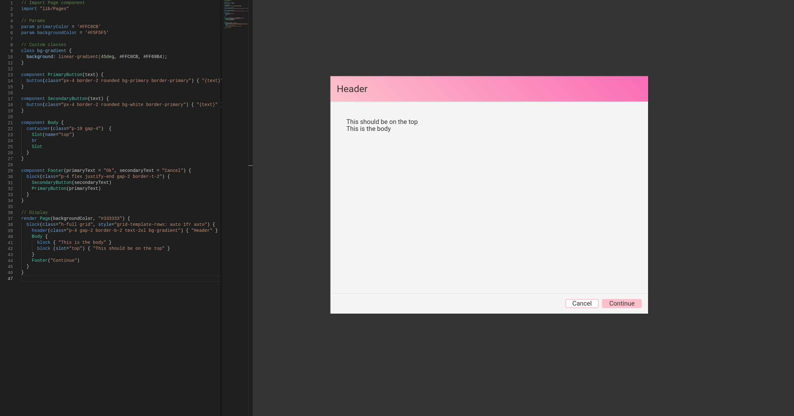

# Stylo

A new Design-as-code language side project. 

[ChatGPT](https://openai.com/blog/chatgpt) help with the name, syntax and boilerplate code.



## The code

This project contains:
* Renderer (Stylo to HTML)
* Code editor (syntax-highlight only)

A language server should be the next thing.

> The code has few to no comments. Read at your own risk.

### Run the application

The solution uses `yarn workspaces` as the idea was to share code easily.

Run `yarn && yarn start` to install packages, compile and open the browser.

Copy the content of the [example.stylo](./example.stylo) file.

## The editor

The application has a text editor with syntax highlight on the left, and the render on the right.
We can zoom and move the rendering as we please.

Hovering on an element in the render will highlight the code definition of the left.

> To see compilation errors press F12 and check the console.

## The language

### Concept

The idea was to create a competitor for [Figma](https://www.figma.com/).
Instead of export code from designs, I wanted to export design from code.

The code concept was reusability of UI elements. So variables, components and imports were the priority.
I should also be easy enough to learn for designers who might have little experience with code.

I also wanted some kind of standard way to apply styling.
I chose [Tailwind](https://tailwindcss.com/) because of its recent popularity,
but custom CSS classes and attributes are supported.

### Keywords

Definition:
* `render`
* `component`
* `class`
* `param`
* `Slot`
* `import`

Attributes:
* `class`
* `style`
* `slot`

### Render

To show anything on the right panel, we use the `render` keyword. We can render a component or direct *HTML*.

```javascript
// HTML
render span { "Hi" }

// Component

render Button("Hi")
```

### Components

Components are first-class citizens in *Stylo*. The body of components uses a tree structure like *HTML*. 

```javascript
component Footer {
  block { "Hello" }
}
```

`block` is NOT a keyword. We  can use whatever makes sense to us as long as it's in *camelCase*.

#### Parameters

Components support parameters (`string`). They can also have a default value.

```javascript
component PrimaryButton(text = "Continue") {
  button { "{text}" }
}
```

We can then just pass a value when using the component.

```typescript
render PrimaryButton("Ok")
```

### Styling (class and style)

As mention above, [Tailwind](https://tailwindcss.com/) is supported by default.

```javascript
component SecondaryButton(text) {
  button(class="px-4 border-2 rounded bg-white border-red") { "{text}" }
}
```

#### Custom classes

We can define custom CSS classes with the `class` keyword.

```css
class bg-gradient {
  background: linear-gradient(45deg, #FFC0CB, #FF69B4);
}
```

#### Custom stylo

Finally, we can write inline style too.

```typescript
component PrimaryButton(text) {
  button(class="px-4 rounded bg-primary", style="border: 2px solid red") { "{text}" }
}
```

### Parameters

We can define variables to share in the project. We use the `param` keyword.

```typescript
param primaryColor = '#FFC0CB'
param backgroundColor = '#F5F5F5'
param welcomeText = 'Hello'
```

We can use them as components input values. 
If we define a variable that ends with `Color`, multiple *CSS* classes are generated:
* `text-{color}`
* `bg-{color}`
* `outline-{color}`
* `border-{color}`
* `border-y-{color}`
* `border-x-{color}`
* `border-t-{color}`
* `border-r-{color}`
* `border-b-{color}`
* `border-l-{color}`

### Slots

The last feature of the components is slots. They let us create shells without specifying the content itself.

```typescript
component Body {
  container(class="p-10 gap-4")  {    
    Slot(name="top")
    br
    Slot
  }
}
```

We then pass what we want to the container.

```typescript
Body {
  block { "This is the body" }
  block (slot="top") { "This should be on the top" }
}
```

`name` is used in the slot definition to distinguish them.

`slot` is used in the component usage to specify in which slot it should be rendered.

### Import

To conclude the reusability objectives, the `import` keyword is critical.

Inspired by [Deno](https://deno.com/), we can import any `.stylo` code from and *URL*.

```typescript
import "https://myrepo/Buttons"
```

There's also a `Pages` library within the code. But there's only one component so far.

```typescript
import "lib/Pages"
```

## Conclusions

I publish the code just for historic purposes.

While I like the language itself, and I learned A LOT, I don't see a demand for it.

For designers, it's easier to keep doing what they do. Figma supports design tokens and reusable components already. They also recently released a plugin for *VS Code*, but I don't think it will be a success.

It's true that from the *Abstract Syntax Tree*, we can export *Angular*, *React*, *Vue* or anything we like.
However, this is good only for greenfield projects. Once the project grows, it's incrementally harder to keep the design and the code is sync.
Ironically, the same problem I had writing this with the help of *ChatGPT*!

If *Figma* succeeds with the dev plugin, I might regret not keep going with this project, but it has been great fun.
